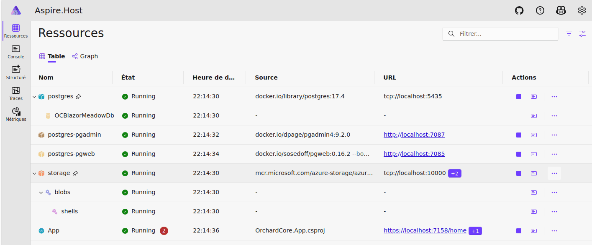

# Meadow Orchard CMS with ASP.NET Aspire

 This Blazor app is a POC for using together:
 

 - Meadow framework with Jetson Orin Nano
 - a new Meadow driver for the ICM20948 sensors (included on IMX219-83 dual cameras kit), converted from a C linux driver
 - Orchard Core: an open-source .net Foundation project, that can be used as a CMS or a framework
 - Blazor (server mode) with Orchard Core
 - Ant Blazor components (Ant Blazor Pro + Ant Blazor Charts))
 - Aspire with Orchard Core (-> docker)

 

 Thanks to:
 - https://github.com/nubiquest-blogs/orchard-core-with-aspire for the tutorial for Aspire with Orchard Core
 - https://docs.orchardcore.net/en/main/guides/create-blazor-cms/ for Blazor with Orchard Core
 - https://github.com/mtmal/ICM20948-linux-i2c for the ICM20948 linux driver (in C language)
